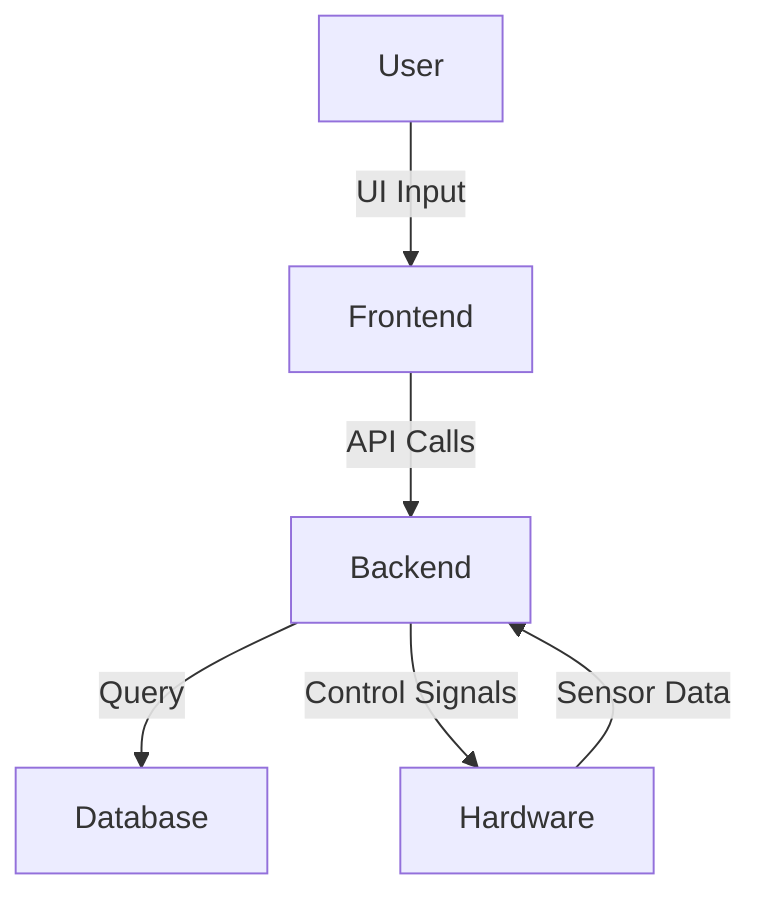

# 🚀 Project Title: Oil-Spill-Detection-Dashboard

## 📌 Overview
This system detects oil spills using SAR (Synthetic Aperture Radar) imagery and autonomously deploys a USV (Unmanned Surface Vehicle) to collect and contain the oil.

## 🧠 Key Features
- ✅ Real-time tracking
- ✅ Web App Integration
- ✅ Admin Dashboard / Data Analytics
- ✅ AI/ML integration

## 🛠️ Technologies Used

### 💻 Frontend


### 🧩 Backend


### 🗄️ Database


### ⚙️ Hardware 


## 🧩 Available Platforms
- 🌐 Web
- 🚀 Embedded (ESP32)

## ⚙️ System Architecture
> _USV Provide Cleaning and Data To Process_


## 📸 Screenshots / Demo

| Dashboard |
|-------------|
| 


[image](https://github.com/user-attachments/assets/65db5939-2827-4cd3-8574-c5eef6bef471)
|

> 📽️ [Demo Video]((https://youtu.be/Yhkxk3OObf8))

## 📱 Installation & Setup

### Prerequisites
- [ ] Node.js (vXX.X.X)
- [ ] ESP32
- [ ] Visual Studio Code

### Setup Steps
```bash
# Clone the repository
git clone https://github.com/Raghavan2005/oil-spill-detection-dashboard.git
cd oil-spill-detection-dashboard

# Install dependencies
npm install         # For Node.js backend

# Start the development server
npm run dev         # or node server.js

```

## 📄 License
This project is licensed under the [MIT License](LICENSE).

